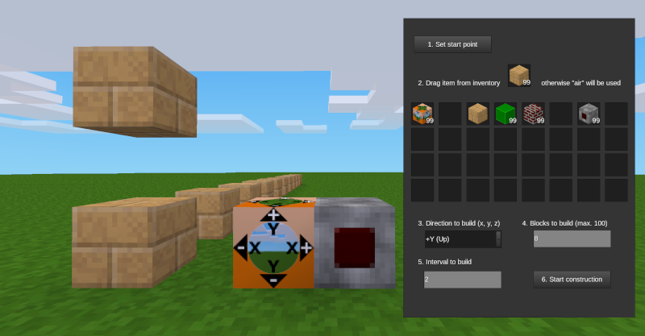

# XYZ Constructor

Der Mod »XYZ Constructor« ermöglicht es, einen ausgewählten Block x-mal in einem vorgegebenen Intervall zu platzieren. Abhängigkeit: default. Privileg: xyzconstructor-Privileg nötig.

With this mod you can place a selected block x-times in a given interval. Depends: default. Privileg: xyzconstructor privileg needed.

Verwendung:
Man benötigt das Privileg »xyzconstructor«, um das Formspec des Blockes mit Rechtsklick öffnen, bearbeiten und speichern zu können.

Nach dem Platzieren des XYZ Constructor-Block öffnet man diesen mit Rechtsklick. Im nächsten Schritt setzt man den Startpunkt der Konstruktion (Linksklick auf einen bestehenden Block). Danach öffnet man den Constructor-Block erneut, wählt einen Block aus dem Inventar aus und bestimmt Richtung, Intervall und Anzahl des zu setzenden Blockes. Anschließend startet man den Konstruktionsvorgang.

Mese: Der Constructor-Block lässt sich auch mit einem Mese-Schalter steuern.

Hinweise:
Es fehlen noch Sicherheitsabfragen: Befinden sich bereits Blöcke in Baurichtung? Ist ein oder gar mehrere Blöcke in Baurichtung geschützt? Wird in einem geschützten Gebiet gebaut (protected area)?

Lizenz:
Copyright (C) 2021 Norbert Thien, multimediamobil - Region Süd, Lizenz: Creative Commons BY-SA 4.0
